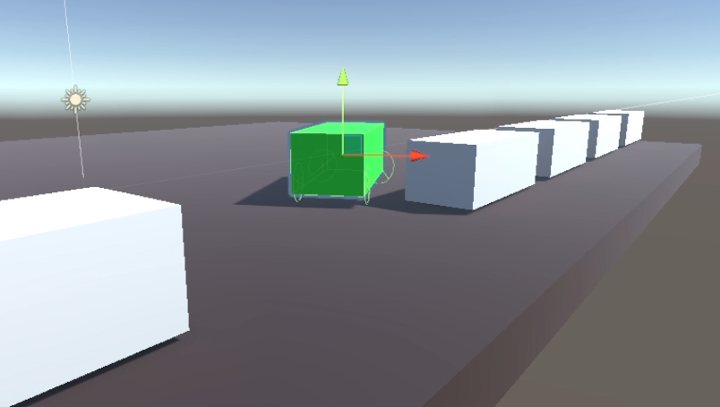

# [Ki] G10 (WS21)

## Teammitglieder
| Name | Martikelnummer | Studiengang |
|:-----| :---------------:|:-----------:|
| Lukas Momberg | 11141259 | AI |
| Jona Siebel | 11141394 | AI |
| Dennis Goßler | 11140150 | AI |
| Thomas Donst | 11138843 | AI | 
| Patrick Schuster | 11126452 | AI | 

## Bilder

### Aufgabe 1 (Genetische Algorithmen)

### Aufgabe 3 (Monte Carlo Lokalisierung)
/MeatBall.png)
